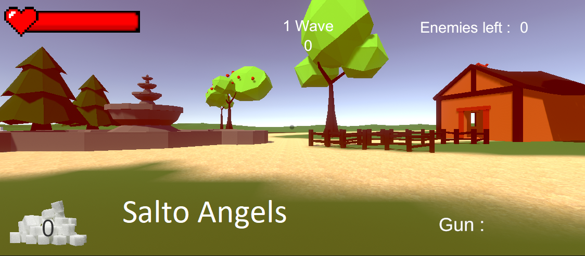

# first_game by Salto angels	 
Filip Grzelak https://github.com/filipgrzelak  
Anastazja Załataja https://github.com/Bananasa  
Mateusz Banasik https://github.com/kilifux  
Paweł Dera https://github.com/Rejwel  

<a href="https://drive.google.com/drive/folders/1iIM1e2dCnZIbMTmhUjMNdBpNJc5fkVYt?usp=sharing">Link do gry</a>

-------------------------------------------------------------

## v. 0.4

Gra na stan obecny opiera sie na zabijaniu przeciwnikow. Gracz wygrywa
zabijajac wszystkich przeciwnikow po ostatnim wave.

### Zaimplementowane demo :
-> sklep  
-> skille (dash,djump,shield)  
-> movement  
-> strzelanie wraz z przeładowaniem  
-> SFX  
-> system amunicji  
-> bronie (klawisze 1-4)  
-> towery (stawiamy na klawisz "p")  
-> waluta  
-> wave system  
-> enemy  

### Modele : 
-> Drzewa  
-> Fontanna  
-> Dom  
-> Stodoła   
-> Szopa  

### Znane bugi : 
-> Po utracie hp nadal zyjemy  

